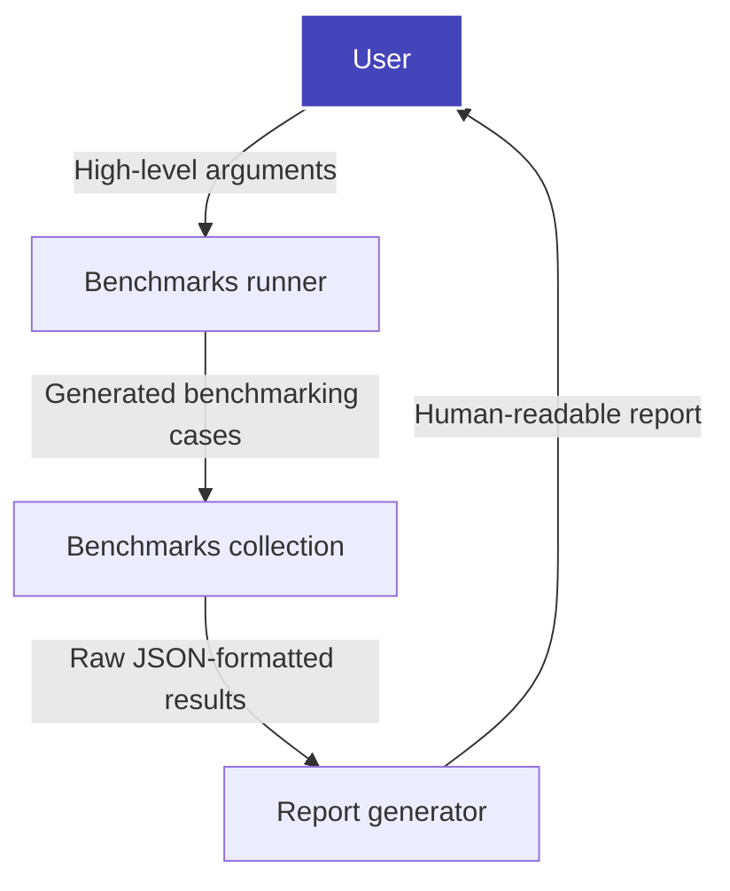

# Machine Learning Benchmarks

[Developer Guide](docs/README.md)

[](https://dev.azure.com/daal/scikit-learn_bench/_build/latest?definitionId=8&branchName=main)

**Scikit-learn_bench** is a benchmarking tool for libraries and frameworks implementing Scikit-learn-like APIs and other workloads.

Features:
- Full control of benchmarks suite through CLI
- Flexible and powerful benchmarking config structure
- Ability to run with advanced profiling tools (*Intel(R) VTune(TM)* and others)
- Automated generation of benchmarks report

## 📜 Table of content

- [Machine Learning Benchmarks](#machine-learning-benchmarks)
  - [📜 Table of content](#-table-of-content)
  - [🔧 How to create Python environment for benchmarking](#-how-to-create-python-environment-for-benchmarking)
  - [🚀 How to use scikit-learn\_bench](#-how-to-use-scikit-learn_bench)
    - [Benchmarks runner](#benchmarks-runner)
    - [Report generator](#report-generator)
    - [Scikit-learn\_bench high-level workflow](#scikit-learn_bench-high-level-workflow)
  - [📚 Benchmark types](#-benchmark-types)
  - [📑 Documentation tree](#-documentation-tree)

## 🔧 How to create Python environment for benchmarking

Create a suitable Python environment to use depending on needed frameworks:

- **sklearn, sklearnex and gradient boosting frameworks**:

```bash
# with pip
pip install -r envs/requirements-sklearn.txt
# or with conda
conda env create -n sklearn -f envs/conda-env-sklearn.yml
```

- **RAPIDS**:

```bash
conda env create -n rapids --solver=libmamba -f envs/conda-env-rapids.yml
```

## 🚀 How to use scikit-learn_bench

### Benchmarks runner

Call required benchmarking cases from specified config using `sklbench` module as runner:

```bash
python -m sklbench --config configs/sklearn_example.json
```

Default output of runner is a file with JSON-formatted results of benchmarking cases. To generate better human-readable report inplace, you can request it by adding specific argument:

```bash
python -m sklbench --config configs/sklearn_example.json --generate-report
```

By default output and report file paths are `result.json` and `report.xlsx`. Add next argument to specify custom file paths:

```bash
python -m sklbench --config configs/sklearn_example.json --generate-report --result-file result_example.json --report-file report_example.xlsx
```

For description of all benchmarks runner arguments, see [it's corresponding docs section](sklbench/runner/README.md#arguments).

### Report generator

Raw result files gathered from different environments can be combined by calling report generator:

```bash
python -m sklbench.report --result-files result_1.json result_2.json --report-file report_example.xlsx
```

For description of all report generator arguments, see [it's corresponding docs section](sklbench/report/README.md#arguments).

### Scikit-learn_bench high-level workflow



## 📚 Benchmark types

**Scikit-learn_bench** supports next types of benchmarks:

 - `Scikit-learn estimator` benchmark which measures performance and quality metrics of [sklearn-like estimator](https://scikit-learn.org/stable/glossary.html#term-estimator).
 - `Function` benchmark which measures performance metrics of specified function.

## 📑 Documentation tree
[Scikit-learn_bench](README.md):
- [Configs](configs/README.md)
  - [Benchmarking config specification](configs/BENCH-CONFIG-SPEC.md)
- [Benchmarks runner](sklbench/runner/README.md)
- [Report generator](sklbench/report/README.md)
- [Benchmarks](sklbench/benchmarks/README.md)
- [Data processing](sklbench/datasets/README.md)
- [Developer Guide](docs/README.md)
