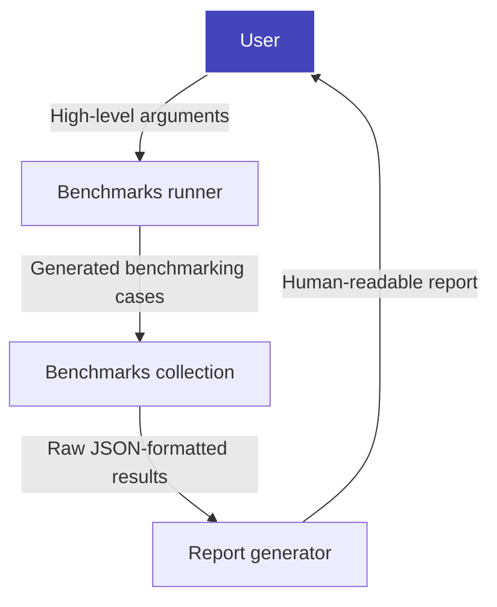

# Machine Learning Benchmarks

[](https://dev.azure.com/daal/scikit-learn_bench/_build/latest?definitionId=8&branchName=main)

**Scikit-learn_bench** is a benchmark tool for libraries and frameworks implementing Scikit-learn-like APIs and other workloads.

Benefits:
- Full control of benchmarks suite through CLI
- Flexible and powerful benchmark config structure
- Available with advanced profiling tools, such as Intel(R) VTune* Profiler
- Automated benchmarks report generation

### 📜 Table of Contents

- [Machine Learning Benchmarks](#machine-learning-benchmarks)
  - [🔧 Create a Python Environment](#-create-a-python-environment)
  - [🚀 How To Use Scikit-learn\_bench](#-how-to-use-scikit-learn_bench)
    - [Benchmarks Runner](#benchmarks-runner)
    - [Report Generator](#report-generator)
    - [Scikit-learn\_bench High-Level Workflow](#scikit-learn_bench-high-level-workflow)
  - [📚 Benchmark Types](#-benchmark-types)
  - [📑 Documentation](#-documentation)

## 🔧 Create a Python Environment

How to create a usable Python environment with the following required frameworks:

- **sklearn, sklearnex, and gradient boosting frameworks**:

```bash
# with pip
pip install -r envs/requirements-sklearn.txt
# or with conda
conda env create -n sklearn -f envs/conda-env-sklearn.yml
```

- **RAPIDS**:

```bash
conda env create -n rapids --solver=libmamba -f envs/conda-env-rapids.yml
```

## 🚀 How To Use Scikit-learn_bench

### Benchmarks Runner

How to run benchmarks using the `sklbench` module and a specific configuration:

```bash
python -m sklbench --config configs/sklearn_example.json
```

The default output is a file with JSON-formatted results of benchmarking cases. To generate a better human-readable report, use the following command:

```bash
python -m sklbench --config configs/sklearn_example.json --report
```

By default, output and report file paths are `result.json` and `report.xlsx`. To specify custom file paths, run:

```bash
python -m sklbench --config configs/sklearn_example.json --report --result-file result_example.json --report-file report_example.xlsx
```

For a description of all benchmarks runner arguments, refer to [documentation](sklbench/runner/README.md#arguments).

### Report Generator

To combine raw result files gathered from different environments, call the report generator:

```bash
python -m sklbench.report --result-files result_1.json result_2.json --report-file report_example.xlsx
```

For a description of all report generator arguments, refer to [documentation](sklbench/report/README.md#arguments).

### Scikit-learn_bench High-Level Workflow



## 📚 Benchmark Types

**Scikit-learn_bench** supports the following types of benchmarks:

 - **Scikit-learn estimator** - Measures performance and quality metrics of the [sklearn-like estimator](https://scikit-learn.org/stable/glossary.html#term-estimator).
 - **Function** - Measures performance metrics of specified function.

## 📑 Documentation
[Scikit-learn_bench](README.md):
- [Configs](configs/README.md)
- [Benchmarks Runner](sklbench/runner/README.md)
- [Report Generator](sklbench/report/README.md)
- [Benchmarks](sklbench/benchmarks/README.md)
- [Data Processing and Storage](sklbench/datasets/README.md)
- [Emulators](sklbench/emulators/README.md)
- [Developer Guide](docs/README.md)
