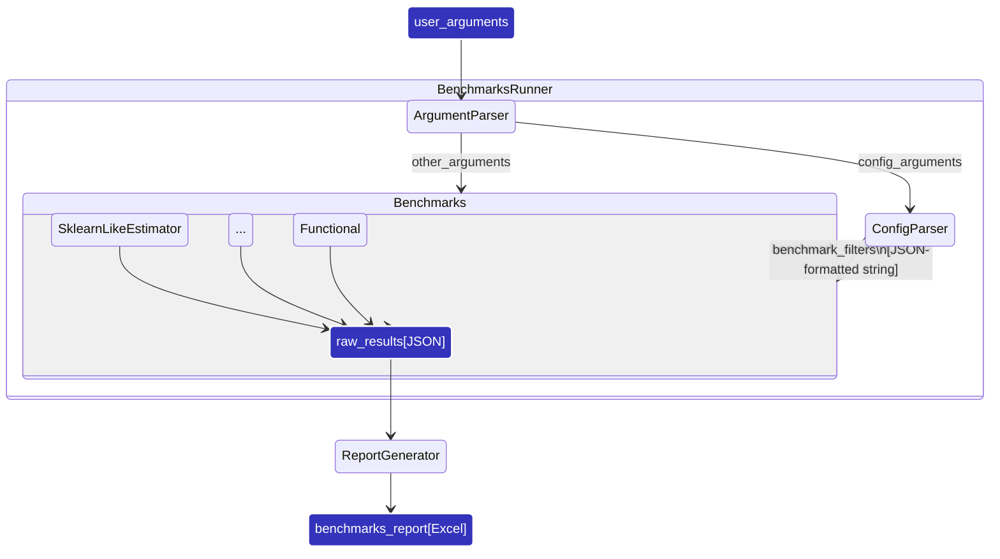

# Developer Guide

This document covers topics useful for contributors to Scikit-learn_bench:

- [Developer Guide](#developer-guide)
  - [High-level workflow of Scikit-learn\_bench](#high-level-workflow-of-scikit-learn_bench)
  - [Configs parser workflow](#configs-parser-workflow)

## High-Level Workflow of Scikit-learn_bench

Scikit-learn_bench consists of three main parts:
 - **Benchmarks runner**:
     1. Consumes user-provided high-level arguments (argument parser).
     2. Transforms arguments to benchmark cases as parameters for individual benchmarks (config parser).
     3. Combines the raw outputs.
 - **Individual benchmarks** wrapping specific entities or workloads (sklearn-like estimators, custom functions, etc.)
 - **Report generator** which consumes benchmarks' outputs and generates high-level report with aggregated stats

Runner is responsible for orchestration of benchmarking cases, individual benchmarks - for actual run of each case, report generator - for human-readable output.

## Configs parser workflow

Benchmarking configuration exists as two stages:
1. **Benchmarking template** where parameters or group of them might be defined as a *range of values*
2. **Benchmarking case** with deducted *scalar values* of parameters

In other words, the template has the `Dict[str, AnyJSONSerializable]` type, while the case has `Dict[str, Dict[str, ... [str, Scalar] ... ]]`.

Configs parser steps:
1. Find all config files from the user-provided `config` argument or use globally defined `parameters` as a standalone config
2. Convert configs to templates
3. Expand template-special values and ranges to all possible cases
4. Remove duplicated cases and assign case-special values if possible

Special values might be assigned on three stages:
 - During template reading in runner
 - During benchmarking cases generation in runner
 - During run of individual benchmark

Benchmark parameters the following overwriting priority:
1. CLI parameters
2. Config template parameters
3. Parameters set

---
[Documentation tree](../README.md#-documentation)
