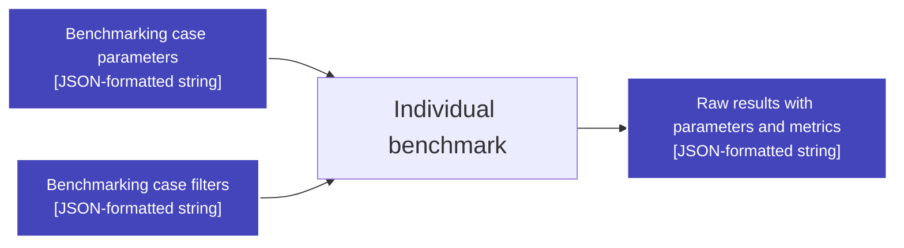

# Benchmarks

## `Scikit-learn Estimator`

Benchmark workflow:
 - Load estimator from the specified library by recursive module search
 - Load data with a common loader function
 - Assign special values that require estimator/data to be loaded
 - Get sklearn/sklearnex context, estimator parameters, running parameters
 - Measure required estimator methods
 - Combine metrics and parameters into the output

See [benchmark-specific config parameters](../../configs/README.md#benchmark-specific-parameters).

## `Function`

Benchmark workflow:
 - Load function from the specified library by recursive module search
 - Load data with a common loader function
 - Construct data arguments in specified order
 - Assign special values that require estimator/data to be loaded
 - Measure function performance metrics

See [benchmark-specific config parameters](../../configs/README.md#benchmark-specific-parameters).

---
[Documentation tree](../../README.md#-documentation)
