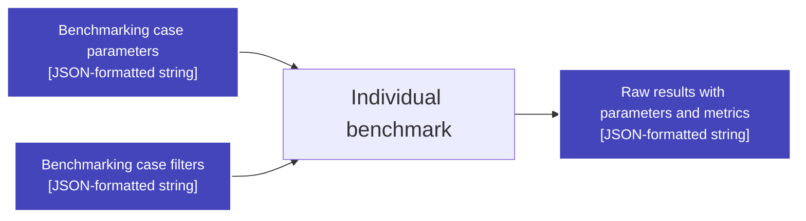

# Benchmarks

## `Sklearn estimator` benchmark

Benchmark workflow:
 - Load estimator from specified library by recursive module search
 - Load data with common loader function
 - Assign special values which requires estimator/data to be loaded
 - Get sklearn/sklearnex context, estimator parameters, running parameters
 - Measure required estimator methods
 - Combine metrics and parameters into output

See benchmark-specific config parameters in corresponding [`sklearn_estimator` section ](../../docs/BENCH-CONFIG-SPEC.md#sklearn_estimator) of benchmarking config specification.

## `Custom function` benchmark

Benchmark workflow:
 - Load function from specified library by recursive module search
 - Load data with common loader function
 - Construct data arguments in specified order
 - Assign special values which requires estimator/data to be loaded
 - Measure function performance metrics

See benchmark-specific config parameters in corresponding [`custom_function` section ](../../docs/BENCH-CONFIG-SPEC.md#custom_function) of benchmarking config specification.
