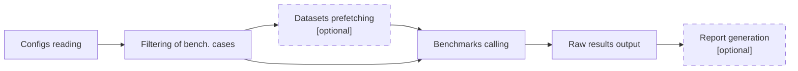

# Benchmarks runner

**Scikit-learn_bench**'s runner orchestrates running of individual benchmarks based on provided config files, parameters, filters and other arguments.

Runner consumes next types of arguments:
 - settings defining benchmarking cases (config location\[s\], global parameters and filters)
 - verbosity levels for different scikit-learn_bench stages (runner, benchmarks, report generator)
 - settings for aggregated benchmarks output
 - scikit-learn_bench workflow parameters

and follows next steps:

1. Generate benchmarking cases
2. Filter them where it's already possible to compare parameters and filters (early filtering)
3. Prefetch datasets in parallel if explicitly requested with special argument
4. Sequentially call individual benchmarks as subprocesses
5. Combine raw results and output them as JSON file
6. Call report generator in-place if requested

See [benchmarking config specification](../../docs/BENCH-CONFIG-SPEC.md) for explanation of config files formatting.

## Arguments
<!-- Note: generate arguments table using runner: `python -m sklbench --describe-parser` -->

| Name                                           | Type | Default value | Choices                               | Description                                                                                            |
|:-----------------------------------------------|:-----|:--------------|:--------------------------------------|:-------------------------------------------------------------------------------------------------------|
| `--runner-log-level`                           | str  | WARNING       | ('ERROR', 'WARNING', 'INFO', 'DEBUG') | Logging level for benchmarks runner.                                                                   |
| `--bench-log-level`                            | str  | WARNING       | ('ERROR', 'WARNING', 'INFO', 'DEBUG') | Logging level for each running benchmark.                                                              |
| `--log-level`                                  | str  |               | ('ERROR', 'WARNING', 'INFO', 'DEBUG') | Global logging level for benchmarks: overwrites runner, bench and report log levels.                   |
| `--config` `--configs`                     | str  |               |                                       | Paths to a configuration files or/and directories that contain configuration files.                    |
| `--parameters` `--params` `-p`         | str  |               |                                       | Globally defines or overwrites config parameters. For example: `-p data:dtype=float32 data:order=F`.   |
| `--parameter-filters` `--filters` `-f` | str  |               |                                       | Filters benchmark bench_cases by config parameters. For example: `-f data:dtype=float32 data:order=F`. |
| `--result-file` `-r`                       | str  | result.json   |                                       | File path to store scikit-learn_bench's runned cases results.                                          |
| `--environment-alias` `--env-alias`        | str  |               |                                       | Environment alias to use instead of it's configuration hash.                                           |
| `--prefetch-datasets`                          | Flag | False         |                                       | [EXPERIMENTAL] Load datasets in parallel before running benchmarks.                                    |
| `--describe-parser`                            | Flag | False         |                                       | Print parser description in Markdown table format and exit.                                            |
| `--generate-report` `--gen-report`         | Flag | False         |                                       | Enables generation of report.                                                                          |

Also, benchmarks runner includes and takes into the account [arguments of report generator](../report/README.md#arguments) if `--generate-report` flag is passed.
