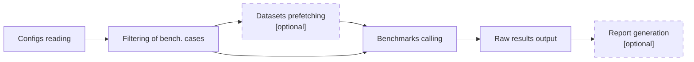

# Benchmarks Runner

**Scikit-learn_bench** runner orchestrates running of the individual benchmarks based on provided config files, parameters, filters, and other arguments.

Runner consumes the following types of arguments:
 - Settings defining benchmarking cases (config location\[s\], global parameters, and filters)
 - Verbosity levels for different scikit-learn_bench stages (runner, benchmarks, report generator)
 - Settings for aggregated benchmarks output
 - Scikit-learn_bench workflow parameters

And follows the next steps:

1. Generate benchmarking cases
2. Filter them if possible to compare parameters and filters (early filtering)
3. Prefetch datasets in parallel if explicitly requested with a special argument
4. Sequentially call individual benchmarks as subprocesses
5. Combine raw results and output them as a JSON file
6. Call report generator in-place if requested

See [benchmarking config specification](../../docs/README.md) for explanation of config files formatting.

## Arguments
<!-- Note: generate arguments table using runner: `python -m sklbench --describe-parser` -->

| Name                                           | Type   | Default value                                       | Choices                                        | Description                                                                                                                      |
|:-----------------------------------------------|:-------|:----------------------------------------------------|:-----------------------------------------------|:---------------------------------------------------------------------------------------------------------------------------------|
| `--runner-log-level`                           | str    | WARNING                                             | ('ERROR', 'WARNING', 'INFO', 'DEBUG')          | Logging level for benchmarks runner.                                                                                             |
| `--bench-log-level`                            | str    | WARNING                                             | ('ERROR', 'WARNING', 'INFO', 'DEBUG')          | Logging level for each running benchmark.                                                                                        |
| `--log-level` `-l`                         | str    |                                                     | ('ERROR', 'WARNING', 'INFO', 'DEBUG')          | Global logging level for benchmarks: overwrites runner, benchmarks and report logging levels.                                    |
| `--config` `--configs` `-c`            | str    |                                                     |                                                | Paths to a configuration files or/and directories that contain configuration files.                                              |
| `--parameters` `--params` `-p`         | str    |                                                     |                                                | Globally defines or overwrites config parameters. For example: `-p data:dtype=float32 data:order=F`.                             |
| `--parameter-filters` `--filters` `-f` | str    |                                                     |                                                | Filters benchmarking cases by parameter values. For example: `-f data:dtype=float32 data:order=F`.                               |
| `--result-file` `-r`                       | str    | result.json                                         |                                                | File path to store scikit-learn_bench's runned cases results.                                                                    |
| `--environment-name` `--env-name` `-e` | str    |                                                     |                                                | Environment name to use instead of it's configuration hash.                                                                      |
| `--prefetch-datasets`                          |        | False                                               |                                                | Load all requested datasets in parallel before running benchmarks.                                                               |
| `--exit-on-error`                              |        | False                                               |                                                | Interrupt runner and exit if last benchmark failed with error.                                                                   |
| `--describe-parser`                            |        | False                                               |                                                | Print parser description in Markdown table format and exit.                                                                      |
| `--report`                                     |        | False                                               |                                                | Enables generation of report.                                                                                                    |

Also, benchmarks runner includes and takes into the account [arguments of report generator](../report/README.md#arguments) if `--report` flag is passed.

---
[Documentation tree](../../README.md#-documentation)
